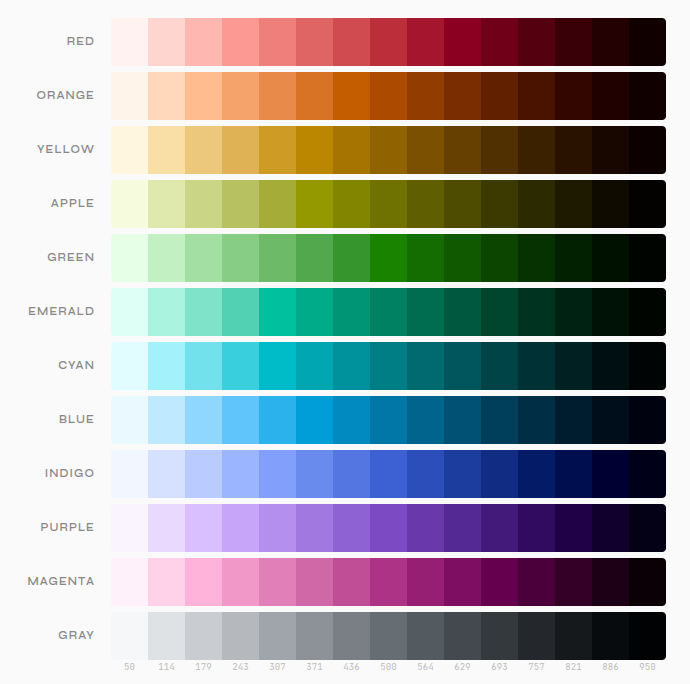
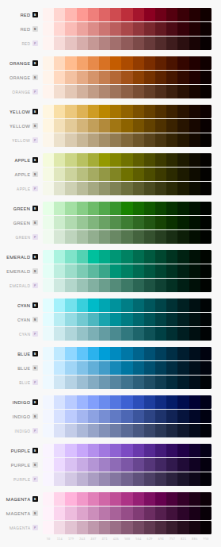
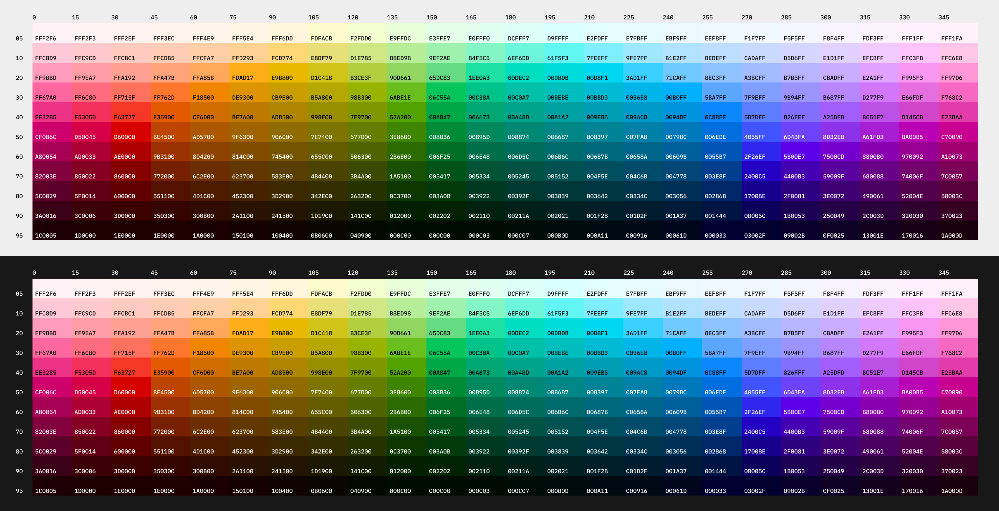
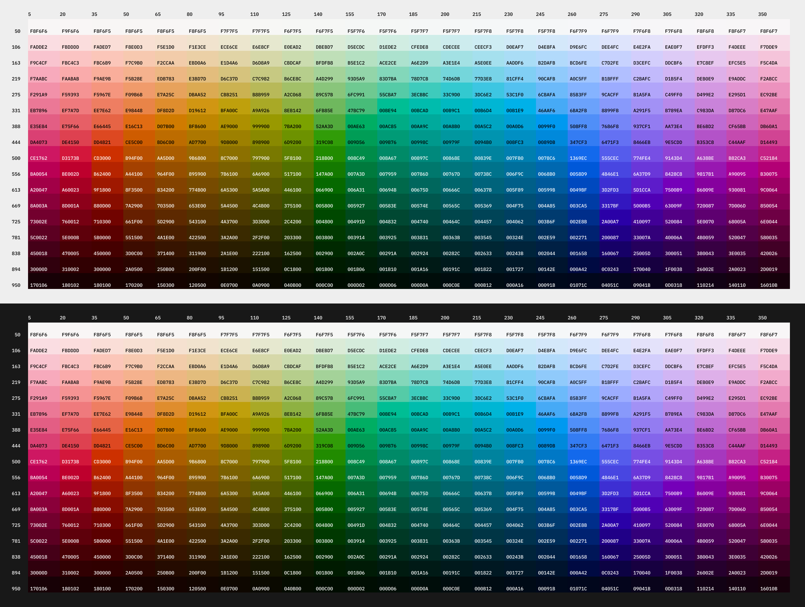
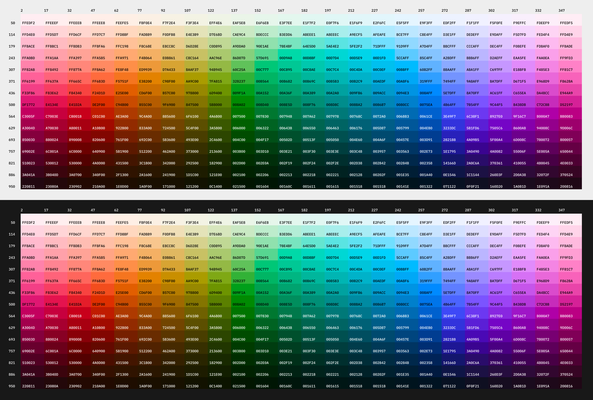

# okLCh Ramp Studio

A single-file, zero-dependency browser tool for generating perceptually uniform UI color ramps using the **okLCh colorspace**, with hex output and multiple export formats.

---

## Overview

Traditional color ramps built in HSL or HSB are perceptually uneven — steps that look visually equal in the color picker may appear dramatically different in weight on screen. okLCh solves this by working in a colorspace modeled on human vision, where equal numeric steps produce equal perceived differences.

okLCh Ramp Studio generates ramps where every stop is defined by:

- **L** — lightness (0 = black, 1 = white), perceptually uniform
- **C** — chroma (colorfulness), automatically shaped by a curve
- **h** — hue angle (0–360°)

All output is converted to sRGB hex for direct use in CSS, design tools, or config files.



---

## Usage

Open `oklch-ramp-studio.html` in any modern browser. No build step, no server, no dependencies. Works on desktop and mobile.

Click any swatch or hex chip to copy that value to the clipboard. Use the Export buttons to generate structured output.

---

## Interface

### Light / Dark Mode

A **DARK / LIGHT** toggle in the header switches the entire page chrome — all backgrounds, borders, text, and UI surfaces — between a near-black dark theme and an off-white light theme via CSS custom property overrides. This lets you evaluate ramp swatches against the same kind of surface they'll actually appear on in your product.

### Contrast Check

An **OFF / WCAG / APCA** toggle in the header enables accessibility contrast checking on the swatch row. When active, each swatch displays a centered badge showing the contrast rating and value. The badge text color — black or white — is chosen by whichever achieves the higher contrast against that swatch, using the WCAG relative luminance formula. This also governs the color of the hex value label on each swatch while checking is active.

**WCAG mode** uses the WCAG 2.1 relative luminance formula and reports contrast as a ratio against white or black (whichever is higher):

| Badge | Contrast ratio | Meaning |
|---|---|---|
| **AAA** | ≥ 7:1 | Enhanced — passes all text sizes |
| **AA** | ≥ 4.5:1 | Minimum — passes normal text |
| **—** | < 4.5:1 | Fail — text on this stop requires care |

**APCA mode** uses the APCA 0.0.98G algorithm (the W3C candidate for WCAG 3.0) and reports contrast in Lc (Lightness Contrast) units. APCA models perceived contrast more accurately than WCAG 2.x, particularly for mid-tone colors and reversed-polarity text. The badge shows the Lc threshold level and the raw value (e.g. `75` / `87.3`):

| Badge | Lc value | Meaning |
|---|---|---|
| **75** | ≥ 75 | Passes for body text |
| **60** | ≥ 60 | Passes for large or bold text |
| **45** | ≥ 45 | Passes for large headings and UI elements |
| **—** | < 45 | Below minimum recommended threshold |

The second line of the badge (ratio or Lc value) is hidden at narrow viewport widths to avoid overlap with the hex label.

### Ramp Display

The hero swatch row at the top renders **dark to light, left to right** — matching the X axis of the curve canvas below, where L = 0 (black) is on the left and L = 1 (white) is on the right. Each swatch displays its hex value persistently, oriented vertically. Click or tap any swatch to copy its hex value to the clipboard.

---

## Controls

### Chroma Curve Canvas

A full-width interactive editor that sits above the control panels and serves as the primary control surface for the chroma curve. The canvas shows three layers of information simultaneously:

- **Solid curve** — the current chroma shape, filled below and stroked in violet. The x-axis is lightness (dark on the left, light on the right); the y-axis is chroma (0 at the bottom, 0.38 at the top).
- **Dashed ceiling** — the maximum in-gamut sRGB chroma at each lightness value for the active hue, sampled across the full L range. The ceiling adapts in real time to the Hue and Hue Shift settings, so it reflects the actual gamut boundary at whatever hue each step lands on. When the solid curve runs below the dashed line there is room to increase chroma; when it approaches or exceeds it, gamut mapping will engage.
- **Step diamonds** — each ramp stop is plotted as a colored diamond at its exact (L, C) position. Hovering or dragging any node subdues the diamonds to make the curve shape easier to read.

**Dragging nodes:** Each of the five control points is directly draggable on the canvas — no need to reach for the sliders.

| Node | Shape | Axes | Behaviour |
|---|---|---|---|
| **Dark** | Circle with vertical bar | L only | Sets the dark anchor of the chroma spline (where chroma reaches zero on the dark side). Horizontal drag only — chroma is always 0 here. |
| **L-Knee** | Circle | L and C | Controls the rise from the dark anchor toward the peak. Drag right to delay the rise; drag up to broaden the dark shoulder. |
| **Peak** | Circle | L and C | The chroma apex. Drag up/down to set the peak chroma; drag left/right to shift where it falls in lightness. |
| **R-Knee** | Circle | L and C | Controls the descent from the peak toward the light anchor. Mirrors L-Knee on the light side. |
| **Light** | Circle with vertical bar | L only | Sets the light anchor of the chroma spline. Horizontal drag only. |

**Selecting nodes:** A persistent tab row sits directly below the canvas, always showing all five nodes and their current parameter values at a glance. Click any tab — or click the corresponding node on the canvas — to select it. The selected tab highlights with an accent underline and its precision slider controls expand below the tab row. Click an empty area of the canvas to deselect; the tab row remains visible with the values still readable. Drag interaction and selection work simultaneously — dragging a node also selects it and activates its tab.

| Tab / Node | Values shown in tab | Controls shown when active |
|---|---|---|
| **Dark** | `L` | Curve dark |
| **L-Knee** | `L  C` | L-Knee L, L-Knee C |
| **Peak** | `L  C` | Peak L, Peak C, Peak Q |
| **R-Knee** | `L  C` | R-Knee L, R-Knee C |
| **Light** | `L` | Curve light |

### Hue & Chroma

| Control | Description |
|---|---|
| **Hue** | Base hue angle in degrees (0–360). The slider track renders a live perceptual hue gradient. |
| **Saturation** | A multiplier applied to the entire chroma curve. 1.0 = curve as-is; values below 1 produce more neutral/muted ramps; values above 1 push toward maximum chroma. |
| **Hue shift** | Applies a linear hue rotation from the lightest to darkest stop. +20° on a blue ramp, for example, will push darks slightly toward purple and lights toward cyan — mimicking the natural appearance of pigment. Set to 0 for a clean, hue-stable ramp. The dashed gamut ceiling on the canvas adapts to reflect the shifted hue at each lightness position. |
| **Smoothing** | When **YES**, softens the apex stop — the step with the highest chroma after gamut adjustment — by replacing its chroma with the midpoint between its current value and the average of its two neighboring steps. This rounds off the sharpest peak in the discrete ramp without affecting any other stops. Useful when the apex step reads as a discontinuous jump in colorfulness relative to its neighbors, particularly with narrow-bandwidth curves or when gamut compression has flattened surrounding stops. Default **NO**. |
| **Color space** | Controls which perceptual color model is used to convert L, C, h values into sRGB hex output. **OKLCH** (default) uses OKLab (Björn Ottosson, 2020). **SRLCH** uses SRLAB2 cylindrical coordinates (Jan Behrens, 2011), scaling L × 100 and C × 300 to SRLAB2 natural units. **CIELCH** uses CIE L\*C\*h° (CIELAB cylindrical), scaling identically. **LCHUV** uses CIELChUV, the cylindrical form of CIELUV — the same L\* definition as CIELAB but with u\*/v\* chromatic axes derived from the CIE 1976 UCS diagram, also scaling L × 100 and C × 300. **JzCzHz** uses the cylindrical form of JzAzBz (Safdar et al., 2017), a modern HDR-capable space built on the ST 2084 PQ transfer function. Jz maps directly to the UI L range [0, 1] (D65 white ≈ 0.9999); Cz is scaled by 0.5 to match the sRGB gamut range. When any non-OKLCH space is active, the hue gradient and gamut ceiling overlay update to reflect that space's sRGB boundary. See [Comparing color spaces](#comparing-color-spaces) for guidance. |
| **Out-of-gamut** | Controls how colors outside the sRGB triangle are handled. **SMART** binary-searches for the highest in-gamut chroma at the same L and h — hue and lightness fully preserved; recommended for design systems. **NAIVE** clips RGB channels directly — fast but colors shift in both hue and lightness. **COMP** applies per-channel ratio compression: excess chroma above the gamut ceiling is attenuated by the **Ratio** (1.5:1–20:1) rather than hard-cut, preserving more saturation intent with a small lightness drift. |

The remaining chroma curve controls (**Peak L**, **Peak C**, **Peak Q**, **L-Knee L/C**, **R-Knee L/C**, **Curve dark**, **Curve light**) appear in the node tab row below the canvas — click the corresponding tab or canvas node to expand its controls.

### Lightness Range & Steps

| Control | Description |
|---|---|
| **Ramp light** | Lightness of the lightest stop (step 50). Default 0.97 ≈ near-white. Independent of the chroma curve's light anchor — steps that fall outside the curve anchor range simply receive zero chroma. |
| **Ramp dark** | Lightness of the darkest stop (step 950). Default 0.12 ≈ very dark. Independent of the chroma curve's dark anchor. |
| **Steps** | Number of stops in the ramp. Odd values only (3–21). Stop keys are distributed evenly across a 50–950 scale (e.g. 11 steps → 50, 140, 230 … 950). |

### L Spacing

Controls how lightness values are distributed across the ramp. All four modes anchor the lightest and darkest stops at the same L values — only the placement of the intermediate stops changes.

| Mode | Behavior |
|---|---|
| **LINEAR** | Equal spacing between every L value. Simple and predictable; a good default when you want evenly distributed stops. |
| **PARABOLIC** | Steps concentrate near the lightest and darkest extremes, with wider gaps in the midtones. Implemented as a blended cosine ease-in/out (`75% cosine + 25% linear`). Because chroma peaks in the midtones, this places fewer stops where chroma variation is highest and more stops near the neutral extremes — useful when you need fine-grained light and dark shades for surfaces and text while accepting coarser midtone resolution. |
| **ADJUSTED** | Applies a gamma-like correction (`t^0.77`) derived from the Munsell value scale, which models perceived equal lightness steps in human vision. The result compresses the dark end slightly relative to the light end, producing stops that feel more equidistant when viewed. Recommended when perceptual uniformity matters most — for example, accessible neutral ramps or UI grays where banding is noticeable. |
| **ARC** | Divides the chroma curve into equal arc-length intervals, measuring distance as Euclidean in (L, C) space so that both lightness change and chroma change count toward the spacing. Stops are pulled toward regions of the curve that are steep in chroma (near the peak) and spread apart where the curve is flat (near the neutral extremes). Produces a ramp where each visual step feels like an equal-sized move along the shape of the curve itself. |

The canvas updates in real time to show diamond positions for the active spacing mode.

### Gamut Handling

okLCh can describe colors that lie outside the sRGB triangle. The gamut toggle offers three modes:

| Mode | Behavior |
|---|---|
| **SMART** | Binary-searches for the highest chroma value at the same L and h that still fits in sRGB. Hue and lightness are fully preserved. Recommended for design systems requiring clean, predictable output. |
| **NAIVE** | Clips RGB channels directly after conversion. Fast and simple, but out-of-gamut colors will shift in both hue and lightness. Useful for seeing how much of a ramp is theoretically outside sRGB. |
| **COMP** | Chroma-space ratio compression. For each step, the maximum in-gamut chroma at that exact L and h is found via binary search. If the requested chroma exceeds this ceiling, the excess is retained but attenuated by the compression ratio rather than hard-cut. Because hue is never touched, the result preserves more of the original saturation intent while introducing only a small lightness drift — and because the gamut ceiling varies by hue angle, the effect is uneven across the ramp, producing character that changes as you move the Hue slider. |

**Ratio** (COMP mode only, 1.5:1 to 20:1): Controls how aggressively excess chroma is attenuated. Low ratios like 2:1 retain most of the excess — more character, more drift. High ratios like 16:1 approach hard-clip behavior, converging toward NAIVE. The 3:1–6:1 range tends to be most useful.

### Color System View

Disabled by default. When toggled **ON**, reveals a two-part interface for visualizing your primary ramp alongside up to 11 additional hues — all sharing the same curve settings.

**Controls:**

| Control | Description |
|---|---|
| **ON / OFF toggle** | Enables the system view panel and the visualization matrix below the controls. |
| **Additional hues** | Slider (1–11) setting how many companion ramps to display. Increasing the count auto-fills new slots with hues distributed evenly around the wheel relative to the primary hue (at offsets of 120°, 240°, 60°, 180°, etc.). Decreasing it removes slots from the end without disturbing existing entries. |
| **Hue cards** | One card per additional hue. Each card contains a midtone color dot preview (updates live), an optional text label, a degree input (0–360), and a mini hue-wheel slider. The number input and slider stay in sync. |

**Visualization matrix:**

A full-width ramp grid rendered below the controls. Each row represents one ramp — the primary (marked with an accent border) appears first, followed by additional hues in card order. All rows share the same lightness range, step count, chroma curve, hue shift, and gamut mode as the primary, so every ramp is directly comparable on those axes; only the base hue differs.

Column headers show step keys. Hover any swatch cell to see its hex value in a tooltip; click to copy it to the clipboard. Swatch cells do not expand on hover.

The image above shows a 12-hue system (Red → Gray) as rendered by the Color System View. The saturation comparison below shows three saturation multiplier settings stacked per hue, illustrating how the **Saturation** slider scales the entire chroma curve up or down while keeping the curve shape intact:



---

## Step Key Convention

Steps follow the Tailwind / Radix convention:

```
50 · 140 · 230 · 320 · 410 · 500 · 590 · 680 · 770 · 860 · 950
```

For an 11-step ramp. The lightest stop is always `50` and the darkest is always `950`, with intermediate keys distributed linearly. Fewer or more steps compress or expand the key distribution accordingly.

---

## Export Formats

Click any export button to generate output and copy it to the clipboard. The textarea is also directly selectable. The ramp name (top-right input) is used as the variable/key name in all formats.

### CSS Custom Properties
```css
:root {
  --brand-50: #f4f2ff;
  --brand-140: #e2deff;
  /* … */
  --brand-950: #0e0a2e;
}
```

### JSON
```json
{
  "brand": {
    "50": "#f4f2ff",
    "140": "#e2deff"
  }
}
```

### SCSS Map
```scss
$brand: (
  "50": #f4f2ff,
  "140": #e2deff
);
```

### Tailwind Config
```js
// tailwind.config.js
'brand': {
  '50': '#f4f2ff',
  '140': '#e2deff',
},
```

### Copy All Hex
Newline-separated hex values, darkest to lightest. Paste directly into Figma's "Create styles from selection" or similar bulk-import workflows.

---

## The Chroma Curve

Rather than requiring manual chroma entry per stop, the studio uses a **5-point monotone cubic spline** to describe the chroma-vs-lightness shape. The curve passes exactly through five control points and is anchored to zero chroma at both ends:

```
(curveDark, 0)   →   (lKneeL, lKneeC)   →   (peakL, peakC)   →   (rKneeL, rKneeC)   →   (curveLight, 0)
```

This directly models design intent: you choose where chroma rises, where it peaks, and how it falls — rather than dialing abstract EQ parameters.

### Curve anchors vs. ramp range

The **curve anchors** (Curve dark / Curve light) and the **ramp range** (Ramp dark / Ramp light) are independent settings:

- The curve anchors define where the chroma spline is forced to zero. They are the x-intercepts of the curve and correspond to the **Dark** and **Light** drag nodes on the canvas.
- The ramp range defines the L values of the actual stop endpoints (step 50 and step 950). Steps that fall outside the curve anchor range receive zero chroma automatically.

Keeping the two controls separate lets you, for example, position the dark anchor at L = 0.15 while extending the ramp down to L = 0.05 to include a near-black neutral stop.

### Interpolation

The curve is computed using the **Fritsch-Carlson monotone cubic Hermite spline** algorithm. Monotone interpolation guarantees the spline never overshoots between two adjacent control points, which means chroma cannot go negative or exceed the peak — even when the knee points are set asymmetrically.

### Control points

| Point | Controls |
|---|---|
| **Dark anchor** | Fixed at `(curveDark, 0)` — the lightness at which chroma reaches zero on the dark side. |
| **L-Knee** | `(L-Knee L, L-Knee C)` — shapes how quickly chroma rises from the dark anchor toward the peak. A low L position steepens the initial rise; a high C value broadens the dark shoulder. |
| **Peak** | `(Peak at L, Chroma Peak)` — the chroma apex, scaled by Saturation. **Peak Q** controls the bandwidth: how quickly chroma falls off on either side of the peak. Q = 1.0 is neutral (knee positions unchanged). Higher Q pulls the effective knee positions closer to the peak, sharpening the rolloff; lower Q pushes them farther apart, broadening it. The knee slider values are not modified — Q is applied internally when computing the spline. When the Peak node is selected, two tick marks on the canvas show the current effective bandwidth edges. |
| **R-Knee** | `(R-Knee L, R-Knee C)` — shapes the descent from peak toward the light anchor. Mirrors the role of the left knee on the light side. |
| **Light anchor** | Fixed at `(curveLight, 0)` — the lightness at which chroma reaches zero on the light side. |

The ordering constraint `curveDark < L-Knee L < Peak at L < R-Knee L < curveLight` is enforced at render time, so the curve always has a valid shape regardless of slider positions.

### Gamut ceiling overlay

The canvas draws a **dashed white line** showing the maximum in-gamut sRGB chroma at each lightness value for the current hue. This ceiling is computed via binary search across the full L range (0–1) and updates live as you move the Hue or Hue Shift sliders. When Hue Shift is non-zero, each L position on the ceiling reflects the shifted hue that the corresponding ramp step would actually use, so the ceiling accurately represents the gamut constraint that will apply at that step. The ceiling provides an at-a-glance read of how much headroom the chroma curve has before gamut mapping engages.

---

## Comparing color spaces

### A brief history

**CIELAB** (and its cylindrical form, **CIELCH**) was introduced by the CIE in 1976 as the first widely adopted attempt to create a *perceptually uniform* color space — one where equal numeric distances correspond to equal perceived color differences. It replaced earlier models like Munsell (which required physical samples) with a mathematical formulation derived from opponent-process color theory, using a cube-root–based lightness function and opponent `a*`/`b*` channels.

For two decades CIELAB was the standard for color science, ICC profiles, and industrial color management. It is still embedded in every ICC-aware application, every PDF renderer, and every print workflow.

### The problems with CIELAB

Despite its longevity, CIELAB has known perceptual non-uniformities that have been documented since the 1980s:

- **Hue linearity** — perceived hue does not travel in straight lines through the `a*b*` plane. Blues in particular curve sharply toward purple as chroma increases, so a blue ramp with rising chroma will appear to shift hue even with a fixed `h°` value.
- **Chroma–lightness coupling** — changing chroma at a fixed `L*` can noticeably shift perceived lightness, particularly in the blue and yellow regions. This makes it difficult to build ramps where every stop feels the same visual weight.
- **Achromatic axis instability** — very desaturated colors near the neutral axis can produce slight tints in CIELAB due to the cube-root compression behaving differently near zero, causing grays to appear slightly warm or cool.

These issues were tolerable for color *difference* measurements (CIEDE2000 patches them with correction factors) but they create visible problems when generating UI color ramps, where the goal is a smooth, hue-stable, perceptually uniform gradient.

### Why OKLab was created

In 2020, Björn Ottosson published [OKLab](https://bottosson.github.io/posts/oklab/) — a new perceptual color space designed specifically to address CIELAB's non-uniformities. The key insight was to fit the linear transform matrices not to theoretical opponent-process responses, but to empirical data from the [IPT color space](https://www.researchgate.net/publication/221677980) and modern color appearance datasets, using a least-squares optimization over a large set of perceived-equal-difference color pairs.

The result:

- **Straight hue lines** — perceived hue travels in nearly straight lines through the OKLab `ab` plane, so a fixed `h` in OKLCH holds its apparent color identity across a wide chroma range.
- **Decoupled chroma and lightness** — chroma changes at a fixed `L` produce minimal perceived lightness shift, making it reliable for ramp construction.
- **Minimal hue shift in blue** — the blue–purple skew that plagues CIELAB is largely eliminated.
- **Simple math** — the full transform is two 3×3 matrix multiplications and a cube root, with no correction factors or lookup tables.

OKLab was adopted into the CSS Color Level 4 specification as `oklch()` / `oklab()` in 2022 and is now natively supported by all major browsers.

### CIELUV and CIELChUV

CIELUV was published by the CIE in 1976 alongside CIELAB — both were attempts at perceptual uniformity, and neither was declared the winner. CIELAB uses opponent-process `a*`/`b*` axes derived from a cube-root compression of XYZ. CIELUV takes a different approach: it applies a projective transform of XYZ to the *CIE 1976 UCS chromaticity diagram* (`u'v'`), then scales by L\* to produce `u*`/`v*` opponent channels. The result is a different chromatic structure — CIELUV hue angles are not the same as CIELAB hue angles for the same physical color.

CIELUV was historically favored in the **lighting and illumination industry**, where additive color mixtures (light sources, displays, luminaires) are common and the projective chromaticity structure aligns better with how emitted light mixes. CIELAB became dominant in the **print and colorimetry industry**, where reflectance and subtractive mixing are primary. Both spaces share the same L\* definition and the same known non-uniformities in hue linearity and chroma–lightness coupling — they differ primarily in which chromatic axes they use to express color differences.

CIELChUV is the cylindrical projection: `C*_uv = sqrt(u*² + v*²)` and `h_uv = atan2(v*, u*)`. It is comparable to CIELCH in structure but with a different hue rotation and different gamut boundaries in the u\*v\* plane.

### JzAzBz and JzCzHz

In 2017, Safdar et al. published [JzAzBz](https://doi.org/10.1364/OE.25.015131) as a perceptual color space designed specifically for **high dynamic range (HDR) and wide gamut (WCG) content**. Where OKLab uses a cube-root nonlinearity calibrated for SDR displays, JzAzBz replaces it with the **ST 2084 Perceptual Quantizer (PQ)** transfer function — the same electro-optical transfer function used in HDR10 and Dolby Vision. The PQ function is optimized for the full luminance range of human vision (0.001 to 10,000 cd/m²), making JzAzBz perceptually uniform across a much wider brightness span than any CIE-derived space.

The input XYZ values are scaled to absolute luminance (in cd/m²) before applying the PQ function, using a reference white of 203 cd/m² — the standard "reference white" in the HDR10 PQ encoding system. For SDR content where Y = 1 corresponds to approximately 100–203 cd/m², this places sRGB white at Jz ≈ 0.9999. Jz therefore maps almost directly onto the UI's L slider range [0, 1] without additional scaling.

**JzCzHz** is the cylindrical projection: `Cz = sqrt(az² + bz²)` and `Hz = atan2(bz, az)`. It is analogous to OKLCH in structure but uses PQ-based lightness and a different set of cone-response matrices (M1 and M2 from the paper) designed to minimize hue–chroma coupling across the full luminance range.

For SDR ramp generation the practical differences from OKLCH are subtle, but JzCzHz can produce slightly different hue line shapes — particularly in the blue-cyan region — and the PQ lightness compression causes the dark end of ramps to behave differently from OKLab's cube-root compression at very low L values.

### Why SRLAB2 was created

In 2011, Jan Behrens published [SRLAB2](https://www.magnetkern.de/srlab2.html) as an intermediate position between CIELAB and the more recent perceptual models. Where CIELAB applies its cube-root nonlinearity to XYZ values scaled by the D65 reference white directly, SRLAB2 first passes those XYZ values through a re-optimized chromatic adaptation transform (based on CAT02 cone responses with Hunt-Pointer-Estevez primaries for the inverse). The resulting pre-nonlinearity values are a better substrate for the cube-root step, reducing the same blue–purple hue skew and chroma–lightness coupling that Ottosson later addressed in OKLab.

SRLAB2 retains the identical nonlinearity form as CIELAB and produces L\* values in the same 0–100 range with chroma in comparable units — making it a direct successor to CIELAB that is more perceptually uniform without departing entirely from the CIELAB framework the way OKLab does.

OKLab goes further — its linear transforms were fit empirically to perceptual difference data — and generally outperforms SRLAB2 on hue uniformity benchmarks. But SRLAB2 is a useful intermediate reference, especially when transitioning from a CIELAB workflow or cross-referencing against SRLAB2-based tools.

### When to use each

**Use OKLCH (default) when:**

- Building a production UI ramp. OKLCH gives the most predictable hue stability across the lightness range and is the correct choice for anything that will ship.
- Working with saturated hues, especially blues, teals, or purples — where CIELAB's hue skew is most pronounced.
- You want the chroma curve you've drawn to translate faithfully to perceived colorfulness at every step.
- Comparing or exporting alongside CSS `oklch()` values.

**Use CIELCH when:**

- You need to match or cross-reference colors defined in an existing CIELAB-based workflow — ICC profiles, colorimetry reports, print specifications.
- You want to see the historical CIELAB rendering of a ramp for comparison or academic purposes.
- Your target rendering pipeline internally uses CIELAB (some older design tools, colorimetric measurements, textile industry workflows).

**Use LCHUV when:**

- You need to cross-reference colors defined in a CIELUV-based workflow — display colorimetry, illumination engineering, or lighting-industry color specifications.
- You want to compare CIELUV's chromatic structure against CIELAB for the same ramp (the two spaces produce noticeably different hue distributions, particularly in the yellow-green and blue-cyan regions).
- Academic or research contexts where CIELUV is the reference standard.

**Use SRLCH when:**

- You want CIELAB's familiar L\*C\*h° framework and 0–100 L\* scale with reduced hue skew.
- Comparing against SRLAB2-based tools or validating an SRLAB2 implementation.
- Academic or research contexts where SRLAB2 is the reference standard.

**Use JzCzHz when:**

- Building ramps that will be used in an HDR or wide-gamut context (e.g., ramps for display-P3 or Rec. 2020 targets), where JzAzBz's PQ-based lightness is a better model of the display pipeline than a cube-root approximation.
- Comparing OKLCH output against a JzAzBz reference implementation to validate that both produce equivalent perceived neutrality and hue stability for a given SDR ramp.
- Academic or research contexts where JzAzBz is the reference standard, or when evaluating perceptual color spaces against HDR-aware datasets.
- Exploring JzCzHz hue angles as an alternative to OKLCH for saturated blue and cyan hues, where the two spaces can diverge measurably.

For most SDR web and product design work, the differences between OKLCH and CIELCH are subtle in the midtones but clearly visible at high chroma, particularly for blues and warm yellows. LCHUV produces a distinctly different hue distribution than CIELCH — the hue angles map differently to sRGB primaries — most visibly in the yellow-green and cyan regions. SRLCH produces ramps noticeably better than CIELCH and comparable to OKLCH, with the most visible improvement in the blue and violet hue range. JzCzHz is the most suitable choice for HDR pipelines and produces results comparable to OKLCH for SDR content, with minor differences in dark compression and blue-region hue paths. For production SDR UI work, OKLCH remains the recommended default.

The images below show full hue-spectrum matrices — every hue from 0° to 360° across the columns, ramp stops 50–950 down the rows — rendered first in **OKLCH** and then in **SRLCH**, each in dark and light mode:







---

## Browser Compatibility

Requires a browser with support for:
- `oklch()` CSS color function (for the hue slider track gradient) — Chrome 111+, Firefox 113+, Safari 15.4+
- Canvas 2D API
- Clipboard API (for copy-on-click; degrades silently if blocked)

All color math is implemented natively in JavaScript; no CSS `oklch()` is used for the actual swatch rendering, so the hex output is universally compatible.

---

## File Structure

Single self-contained HTML file. No dependencies, no build step, no network requests after initial Google Fonts load (which is optional and can be removed by substituting a local font stack).

```
oklch-ramp-studio.html   ← everything
README.md
LICENSE
```

---

## License

This project is released under the **MIT License**. See `LICENSE` for the full text.
