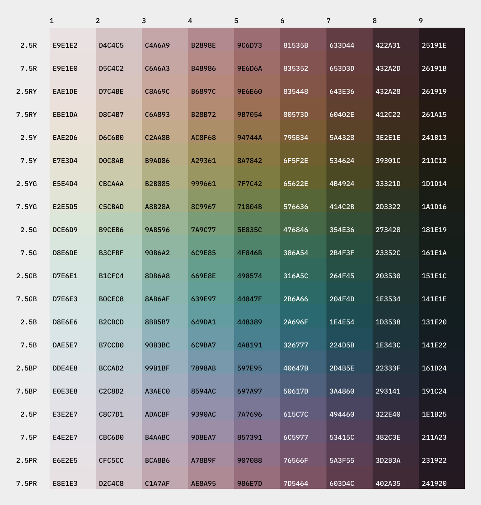
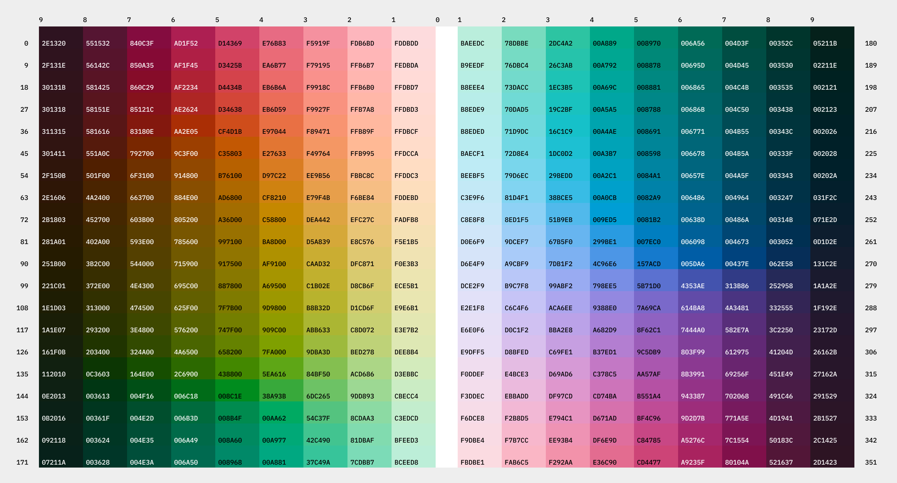

# Comparing Color Spaces

## A brief history

### The Munsell Color System (1905)

In 1905, Albert H. Munsell published *A Color Notation*, one of the first systems to arrange colors by how people *see* them rather than by how pigments or light mix. It defines color with three axes:

- **Hue** — the color family: Red, Yellow, Green, Blue, Purple, plus five intermediates. Hue runs from 0 to 100, with the 10 named categories taking equal 10-unit arcs. One full turn (0–100) equals 360°.
- **Value** — perceived lightness, from 0 (black) to 10 (white). Munsell Value was fit to visual judgments, not raw luminance, which is why its relation to CIE luminance Y is a non-linear fifth-degree polynomial (the Judd formula, standardised in ASTM D1535-18e1), not a simple power law.
- **Chroma** — colorfulness relative to a neutral gray of the same Value. Chroma starts at 0 and has no fixed upper bound. In practice, most colors fall around 0–22, though some yellows and yellow-greens go higher.

<figure>
  
  <figcaption>Munsell matrix with in-gamut chroma curve</figcaption>
</figure>

Munsell was built empirically. Trained observers arranged physical chips into equal visual steps, and those measurements became the reference. The 1943 renotation by Newhall, Nickerson, and Judd measured the chips against CIE standards and produced the definitive CIE `xyY` table for each `(H, V, C)` under CIE Standard Illuminant C. Later perceptual spaces such as CIELAB, OKLab, and CIECAM02 were designed partly to approximate the visual uniformity Munsell established first.

<figure>
  
  <figcaption>Munsell hue x value matrix with compressed chroma curve</figcaption>
</figure>

Because Munsell has no closed-form formula, this tool interpolates directly from the 1943 renotation data. For each requested `(H, V, C)`, it retrieves `L*C*h°(ab)` by bilinear interpolation, adapts Illuminant C to D65 with Bradford chromatic adaptation, then converts to linear sRGB through the standard XYZ→sRGB matrix. The implementation follows [munsell.js](https://github.com/privet-kitty/munsell.js) by privet-kitty (MIT).

In the UI, the controls map to Munsell as follows: **L** `[0, 1] × 10 = Value [0, 10]`; **C** `[0, ~0.4] × 60 = Chroma [0, ~24]`; **H°** `[0, 360]` maps linearly to Hue `[0, 100]`, so `0° = 5R`, `90° ≈ 5Y`, `180° ≈ 5G`, and `270° ≈ 5B`.

### CIELAB and CIELUV (1976)

In 1976, the CIE published **CIELAB** and **CIELUV**, two mathematical attempts at perceptual uniformity. Neither was declared the single winner; each was useful in different contexts.

**CIELAB** and its cylindrical form **CIELCH** became the most widely adopted general-purpose perceptual space. It replaced systems like Munsell, which depended on physical samples, with a formula based on opponent-color theory: a cube-root lightness function plus opponent `a*` and `b*` axes.

For roughly two decades, CIELAB was the default language of color science, ICC profiles, and industrial color management. It is still embedded in ICC-aware applications, PDF rendering, and print workflows.

**CIELUV** was introduced alongside it. Instead of `a*` and `b*`, it projects XYZ into the CIE 1976 UCS chromaticity diagram (`u'v'`) and scales by `L*` to form `u*` and `v*`. That gives it a different chromatic structure, so CIELUV hue angles are not the same as CIELAB hue angles for the same physical color.

Historically, CIELUV was favored more in **lighting and illumination**, where additive mixtures of emitted light are common. CIELAB became dominant in **print and colorimetry**, where reflectance and subtractive workflows matter more. Both spaces share the same `L*` definition and many of the same uniformity limits; the main difference is the chromatic axes used to express color.

**CIELChUV** is the cylindrical form of CIELUV:

`C*_uv = sqrt(u*² + v*²)` and `h_uv = atan2(v*, u*)`

It is structurally similar to CIELCH, but with different hue rotation and different gamut boundaries in the `u*v*` plane.

### Where CIELAB falls short

CIELAB has well-known perceptual non-uniformities, documented since the 1980s:

- **Hue linearity** — perceived hue does not move in straight lines through the `a*b*` plane. Blues especially bend toward purple as chroma increases, so a ramp can seem to shift hue even when `h°` is fixed.
- **Chroma-lightness coupling** — changing chroma at a fixed `L*` can change perceived lightness, especially in blue and yellow regions. That makes equal-weight ramps harder to build.
- **Achromatic-axis instability** — very low-chroma colors near neutral can pick up slight warm or cool casts because the cube-root compression behaves unevenly near zero.

These issues are often tolerable for color-difference work, where formulas like CIEDE2000 add corrections. They are more visible in UI ramps, where the goal is a smooth, hue-stable gradient.

### SRLAB2 (2011)

In 2011, Jan Behrens published [SRLAB2](https://www.magnetkern.de/srlab2.html) as a bridge between CIELAB and newer perceptual models. SRLAB2 keeps the same cube-root-style nonlinearity and a familiar `L*` range of 0–100, but improves the input stage by first applying a re-optimized chromatic adaptation transform based on CAT02 cone responses with Hunt-Pointer-Estevez primaries for the inverse.

That change reduces the blue-purple skew and chroma-lightness coupling seen in CIELAB, while staying closer to the CIELAB framework than OKLab later would.

<figure>
  
  <figcaption>Full hue-spectrum matrix — SRLCH, dark and light mode</figcaption>
</figure>

SRLAB2 is therefore a useful stepping stone: more uniform than CIELAB, still easy to compare with CIELAB-based tools, and less disruptive if you already work in `L*C*h°` terms.

### JzAzBz / JzCzHz (2017)

In 2017, Safdar et al. published [JzAzBz](https://doi.org/10.1364/OE.25.015131), a perceptual space built for **high dynamic range (HDR)** and **wide gamut (WCG)** imaging. Instead of a cube-root transfer like CIELAB or OKLab, it uses the **ST 2084 Perceptual Quantizer (PQ)** transfer function, the same HDR electro-optical transfer function used in HDR10 and Dolby Vision.

PQ is designed for the full human luminance range, about `0.001` to `10,000 cd/m²`, so JzAzBz stays perceptually meaningful across a much wider brightness span than older CIE-derived spaces.

Before PQ is applied, XYZ values are scaled to absolute luminance in `cd/m²`, using a reference white of `203 cd/m²`, the standard PQ reference white in HDR10 systems. For SDR content where `Y = 1` maps to roughly `100–203 cd/m²`, sRGB white lands near `Jz ≈ 0.9999`, so `Jz` lines up closely with a UI lightness slider in `[0, 1]`.

**JzCzHz** is the cylindrical form:

`Cz = sqrt(az² + bz²)` and `Hz = atan2(bz, az)`

It is structurally similar to OKLCH, but it uses PQ-based lightness and the paper’s `M1` and `M2` cone-response matrices to reduce hue-chroma coupling across HDR luminance ranges.

For SDR ramp generation, the difference from OKLCH is usually subtle. The biggest visible changes tend to appear in blue-cyan hue paths and in how the darkest tones compress.

### OKLab / OKLCH (2020)

In 2020, Björn Ottosson published [OKLab](https://bottosson.github.io/posts/oklab/) to address CIELAB’s remaining non-uniformities in modern design and imaging work. The key change was methodological: instead of fitting the space to a theoretical opponent model alone, OKLab fits its transforms to empirical data from the [IPT color space](https://www.researchgate.net/publication/221677980) and modern color-appearance datasets using least-squares optimization over many perceived-equal-difference color pairs.

The result is a space with:

- **Straighter hue paths** — perceived hue travels nearly linearly in the OKLab `ab` plane, so a fixed `h` in OKLCH usually keeps the same visual identity as chroma rises.
- **Better separation of chroma and lightness** — changing chroma at fixed `L` causes less unwanted lightness shift.
- **Less blue skew** — the classic LAB tendency for saturated blues to drift toward purple is greatly reduced.
- **Simple math** — two `3×3` matrix multiplications plus a cube root, with no lookup tables or correction factors.

<figure>
  
  <figcaption>Full hue-spectrum matrix with hex labels — OKLCH, dark and light mode</figcaption>
</figure>

OKLab was added to CSS Color Level 4 as `oklab()` and `oklch()` in 2022, and is now supported by all major browsers. For SDR product and web work, it is the most practical perceptual default in this tool.

## When to use each

**Use OKLCH (default) when:**

- Building a production UI ramp where hue stability matters.
- Working with saturated blues, teals, or purples, where CIELAB’s skew is most visible.
- You want the chroma curve you drew to track perceived colorfulness closely.
- Comparing or exporting against CSS `oklch()` values.

**Use CIELCH when:**

- Matching an older CIELAB-based workflow such as ICC, print, textile, or colorimetry references.
- Comparing a modern ramp against the historical CIELAB rendering.
- Your downstream pipeline still works internally in CIELAB.

**Use LCHUV when:**

- Matching CIELUV-based lighting, display, or illumination specifications.
- Comparing CIELUV’s chromatic structure against CIELAB for the same ramp.
- Working in a research context where CIELUV is the stated reference.

**Use SRLCH when:**

- You want familiar `L*C*h°` behavior with less LAB hue skew.
- Comparing against SRLAB2-based tools or validating an SRLAB2 implementation.
- You need an intermediate reference between CIELAB and OKLab.

**Use JzCzHz when:**

- Building for HDR or wide-gamut targets such as Display-P3 or Rec. 2020.
- Comparing OKLCH against an HDR-aware perceptual model.
- Evaluating dark-end compression or blue-cyan behavior under PQ-based lightness.

**Use Munsell when:**

- Matching physical standards such as the Munsell Book of Color or Soil Color Charts.
- Working in perceptual units rooted in visual observation rather than a fitted formula.
- Comparing how closely modern spaces track empirical perceptual uniformity.

For most SDR web and product design, OKLCH remains the recommended default. CIELCH is mainly useful for compatibility, LCHUV for lighting-oriented references, SRLCH as a better-LAB bridge, JzCzHz for HDR work, and Munsell as the historical empirical baseline.

## Illuminant

Every color space in this tool is defined relative to a *reference white*: the XYZ triplet treated as “perfect white” for that space. All six spaces use **D65** by default, which approximates average northern-hemisphere daylight at about `6500 K` and is the standard white for sRGB, CSS color, and screen design.

The **Illuminant** setting applies a [Bradford chromatic adaptation transform (CAT)](https://en.wikipedia.org/wiki/Chromatic_adaptation) to the linear RGB output of the selected color space. This simulates how the palette would look under another illuminant while still being viewed on a D65 display. The adaptation happens *before* gamut mapping, so the gamut ceiling shown on the curve canvas updates to match the adapted color volume.

### D50 — warm

D50 (`5000 K`) is the standard illuminant for **graphic arts and print**. ICC print workflows, including CMYK press and proofing, are defined under D50. Compared with D65, D50 makes whites look warmer: reds and oranges are emphasized, while blues are reduced.

Use D50 when:
- Designing for print or soft-proofing on a D50-calibrated monitor
- Previewing how a D65 palette reads under warm indoor or print-booth lighting
- Matching ICC-managed pipelines that use D50 as the profile connection space

### Standard D65 — neutral (default)

D65 (`6500 K`) is the reference illuminant for sRGB, Display P3, Rec. 709, and all CSS color functions. For ordinary screen work, this is the correct setting. No chromatic adaptation is applied.

### D75 — cool

D75 (`7500 K`) approximates overcast daylight or cool skylight. Compared with D65, it makes palettes feel cooler and crisper: blues strengthen slightly and reds recede.

Use D75 when:
- Designing for cooler ambient-light environments
- Exploring palette behavior at the cool end of the daylight range
- Comparing illuminant effects in research or teaching

### How the adaptation works

The implementation uses the **Bradford cone-response model** to compute a `3×3` linear RGB→RGB matrix for the selected illuminant. The transform chain is:

```text
linear sRGB (D65) → XYZ_D65 → Bradford LMS → scale by (dest white / D65 white) → Bradford LMS⁻¹ → XYZ_adapted → linear sRGB
```

This is collapsed into one precomputed matrix inside `uiToLinearRGB()`. Because adaptation runs before gamut mapping, the binary search for the sRGB gamut ceiling operates on the adapted color volume, so the clipping indicators on the curve canvas reflect the colors that will clip after the warm or cool shift.

The images below show full hue-spectrum matrices — every hue from `0°` to `360°` across the columns, ramp stops `50–950` down the rows — rendered first in **OKLCH** and then in **SRLCH**, each in dark and light mode:
